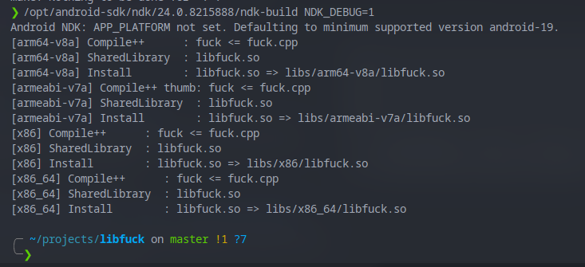
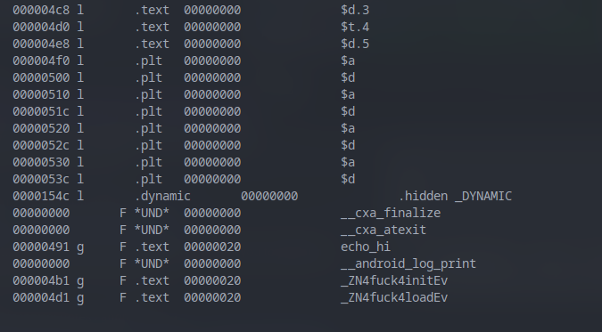

# libpain
Painful understanding of shared objects and the Android NDK Toolchain, has instructions on how to build standalone libraries to inject into Android APKs with ease...

# Prerequisites (or follow the Installation below)

    Android SDK
    Android NDK
    Git

# Installation Guide

## Arch Linux (don't care about the rest)

```sh
yay -S android-studio android-platform android-sdk-platform-tools android-sdk-build-tools android-sdk-cmdline-tools
```

There's 2 ways ot do this, using Android Studio to install or a standalone toolchain.

I promote either way but the former is easier so fire up Android Studio and make a random project.
At the top, hit *Tools* then *SDK Manager*. Select and install Android API 33, or whatever you want. Then go to the SDK Tools tab, and ensure *NDK, SDK Build-Tools, SDK Command-Line Tools, and SDK Platform-Tools* are checked (or installed with the AUR, either way).

If you have an issue with the installation you probably need to chown the /opt/android-studio or /opt/android-sdk folders to your user.

Once done, /opt/android-sdk/ndk should contain a folder which is named the version of your NDK Toolchain. Inside that folder, there should be a bunch of binaries. The one we're interested in is `ndk-build`, which is the tool we need to build our own shared libraries. Either just note where the path is, add it to your path, or export it to your environment. Installation is done.

# Setting up a library

Make your project directory (what it'll be called as lib*.so) and cd into it.
Make a folder inside here called `jni`. This is where you write C/C++ code.

Make a header file and c/cpp file named after what you want the library to be called, i.e. for libpain.so, it should be named pain.cpp and pain.h.

Here's an example pain.h 

### NOTE for any Frida hooking all functions must be static to avoid vtable bullshit and easy symbol export hooking.
```cpp
#pragma once

#include <jni.h>
#include <errno.h>

#include <string.h>
#include <unistd.h>
#include <sys/resource.h>

#include <android/log.h>

class pain
{
public:
    static int load();
    static int init();
    pain();
    ~pain();
};
```

And here's an example pain.cpp

```cpp
#include "pain.h"

#define LOGI(...) ((void)__android_log_print(ANDROID_LOG_INFO, "pain", __VA_ARGS__))
#define LOGW(...) ((void)__android_log_print(ANDROID_LOG_WARN, "pain", __VA_ARGS__))
#define LOGE(...) ((void)__android_log_print(ANDROID_LOG_ERROR, "pain", __VA_ARGS__))

// An example of headers we can include and use in Android! Cool right?
#include <stdio.h>
#include <stdlib.h>
#include <pthread.h>
#include <sys/socket.h>
#include <arpa/inet.h>
#include <iostream>
#include <string>
#include <sys/epoll.h>

extern "C"
{
    int echo_hi()
    {
        LOGI("Hello from libpain!");
        return 0;
    }

    int pain::init()
    {
        LOGI("Init called!");
        // setup something, like maybe connecting to a proxy server :)
        // connect(my_server...) yeah yeah you get it
        return 0;
    }

    int pain::load()
    {
        LOGI("Loading libpain! Let's inject some code!");
        // do whatever, we're hooking this right? 🙃
        return 0;
    }
}
```

# Building the library

Android has something like a Makefile and CMakeLists.txt, which is known as the Android.mk file.

Here's a simple setup:

```mk
LOCAL_PATH := $(call my-dir)

include $(CLEAR_VARS)

APP_OPTIM := debug      # debug mode
APP_CFLAGS := -g        # compiler instruction
APP_ABI := armeabi-v7a  # build for armeabi-v7a architecture

LOCAL_MODULE := pain
LOCAL_SRC_FILES := pain.cpp
LOCAL_LDLIBS := -llog   # to allow android logging

NDK_DEBUG := 1

include $(BUILD_SHARED_LIBRARY)
# You can find more information about Android.mk at https://developer.android.com/ndk/guides/android_mk.html.
```

Afterwards, run ndk-build (remember you should have exported it, added it to path, or just directly call the full path) and it should build the library.

Example output:



Congrats, you have a shared object library that can be injected and loaded into any Android APK for all architectures! Cool right? Anyways, injecting is a topic for another post/repo... ;)

# Frida

Once we finish building, we can hook our libraries code into whatever APK we pack. Now remember we built the libraries? You should have two new folders called libs and obj.

Libs has stripped, production-ready binaries but we don't want that since want to hook mangled debug symbols in Frida. So, the obj folder has these.

Go into obj/local/your_desired_platform/ and you'll see another lib*.so. Run objdump --syms lib*.so, and the output will show all your debug symbols. In my case, I want to hook
`pain::init()` and `pain::load()` in Frida. Here's what my objdump output looks like:



We're interested in `_ZN4pain4initEv` and `_ZN4pain4loadEv` and we can use these to hook them.
If you're curious, _ZN is debug convention, 4 means the namespace name is 4 characters long, then the next 4 means the function name is 4 characters long, and Ev means the function return type is void.

There's two ways to go about this in Frida, hooking or calling a function. Let's say we want to call init to start, which eventually will run a bunch of loads after a certain event. Then we want to hook load to see what data is in there.

A super brief example is as follows:

```js
// Register init 
var init = new NativeFunction(Module.findExportByName('libpain.so', '_ZN4pain4initEv'), 'void', ['pointer']);

// Call init
init(); // This just calls the C code directly, and allows you to interface with C code in Frida Gadget.

// Hook load
Interceptor.attach(Module.findExportByName('libpain.so', '_ZN4pain4loadEv'), {
    onEnter: function(args) {
        console.log("Load was called!!");
    },
    onLeave: function(retval) {
        console.log("Load returning!!");
    }
});
```
